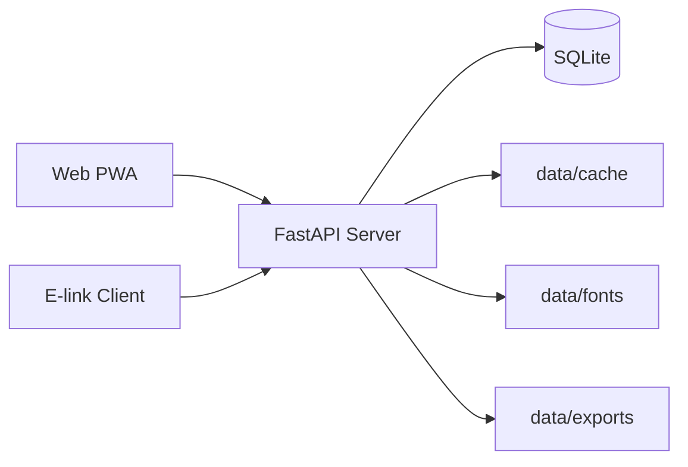

# EasyReader 架构文档

更新时间：2026-06-11

## 文档目的

这份文档只负责四件事：

- 整体系统架构。
- 服务端架构。
- Web PWA 架构。
- 共享 API 约束。

它不负责记录阶段状态、已完成功能清单、部署验收结果和下一步排期；这些内容统一放在 `docs/phase1.md`。墨水屏客户端的内部架构统一放在 `e-link-client/docs/eink-client-plan.md`。

## 整体架构

EasyReader 当前是一个共享内容与共享状态中心驱动的多客户端系统：

- 服务端负责书源解析、共享数据、共享状态和后台任务。
- Web PWA 负责在线优先的通用阅读体验与浏览器侧缓存。
- 墨水屏客户端负责本地阅读优先、设备适配和低功耗交互。

逻辑拓扑：

### 角色边界

| 领域 | 服务端负责 | PWA 负责 | 墨水屏客户端负责 |
| --- | --- | --- | --- |
| 书源能力 | 搜索、详情、目录、正文抓取与清洗 | 不执行书源规则 | 不执行书源规则 |
| 共享数据 | 书架主数据、服务端缓存、字体、导出 | 展示与调用 | 展示与调用 |
| 共享状态 | 阅读进度、书签、离线任务状态 | 消费与上报 | 消费与上报 |
| 阅读交互 | 不负责 | 浏览器阅读体验 | 墨水屏阅读体验 |
| 设备能力 | 不负责 | 浏览器缓存/PWA 安装 | 刷新模式、实体按键、触控热区 |

边界原则：

- 服务端输出稳定数据与共享状态，不承载客户端 UI 状态机。
- 客户端负责阅读体验，不负责书源规则执行。
- PWA 保持在线优先；墨水屏客户端保持本地阅读优先。

## 服务端架构

服务端当前应被理解为“共享内容与共享状态中心”，核心上由四层组成：

### 1. 规则与抓取层

- `backend/engine/` 负责书源规则解析、抓取、解析器和脚本引擎。
- 这一层只解决“如何从书源拿到规范化数据”，不关心客户端 UI。

### 2. 业务服务层

- `backend/services/book_manager.py`：书架主数据、章节缓存、导出前置数据。
- `backend/services/content.py`：书籍详情、目录、章节内容读取。
- `backend/services/search.py`：搜索聚合、去重、排序、源健康度、缓存、`fast/full` 模式。
- `backend/services/sync_manager.py`：阅读进度、书签、离线任务、目录汇总。
- `backend/services/font_library.py`：字体资源管理。

### 3. API 路由层

- `backend/routers/` 对外暴露 `/api/*`。
- 路由层只做协议和参数边界，不承担核心业务判断。

### 4. 存储与任务层

- `backend/database.py` 定义 SQLite schema。
- SQLite 同时承担书架、同步、任务和缓存元数据存储。
- 离线任务由同进程后台任务执行，并把状态落库供轮询读取。

### 服务端核心架构约束

- 资源身份以 `book_key` 为中心，不再以 `book_url + source_url` 作为长期主键。
- 搜索输出的是服务端聚合后的结果，不把排序与去重职责下放给客户端。
- 同步以 `user_id + book_key` 为共享进度主键。
- 离线缓存使用后台任务模型，而不是请求内同步执行模型。

## Web PWA 架构

Web PWA 当前是一个“在线优先 + 本地缓存增强”的客户端，核心分成四层：

### 1. 页面与状态层

- `frontend/src/pages/` 负责书架、搜索、阅读、设置、离线目录等页面。
- `frontend/src/stores/` 负责全局状态与流式搜索结果合并。

### 2. API 访问层

- `frontend/src/api/client.ts` 统一封装请求头、超时、身份查询参数与请求模型。
- PWA 通过这层消费服务端搜索、内容、同步、离线任务和字体接口。

### 3. 本地缓存层

- `frontend/src/utils/chapter-cache.ts` 负责 IndexedDB 章节缓存。
- `frontend/src/utils/local-cache.ts` 负责本地快照缓存。
- `frontend/vite.config.ts` 中的 Workbox runtime caching 提供浏览器缓存兜底。

### 4. 阅读与同步层

- 阅读页命中本地章节缓存时先本地渲染，再按需要联网刷新。
- `frontend/src/utils/sync-queue.ts` 负责按 `user_id + book_key` 收敛的进度补传队列。
- 搜索页通过 `fast/full` 双模式消费服务端流式搜索能力。

### PWA 架构约束

- 阅读体验由浏览器本地状态驱动，不把滚动锚点、菜单状态等 UI 细节回写到服务端。
- 本地缓存是增强层，不替代服务端作为共享数据与共享状态的权威源。
- PWA 不实现书源规则，不在客户端重做搜索排序与去重。

## 共享 API 约束

API 约束只记录多客户端共同依赖的规则，不展开阶段状态与验收结论。

### 身份与版本约束

- 当前没有统一账号体系, 'user_id'统一使用'u1'持久化
- `device_id` 由客户端生成并持久化。
- 所有 `/api/*` 响应头返回：
  - `X-Server-Version`
  - `X-API-Contract-Version`
  - `X-Supported-Client-Types`
- 客户端请求应带上：
  - `X-Client-Type`
  - `X-Client-Version`
  - `X-API-Contract-Version`

### 资源身份约束

- `book_key` 是当前共享资源主身份。
- `book_url + source_url` 仅作为兼容输入存在，不应再作为长期客户端主键。
- 书架、目录、搜索、同步、离线任务、离线目录等共享模型都应返回 `book_key`。

### 响应与缓存约束

- API 直接返回 JSON 模型，不使用统一 `{ code, message, data }` 包装。
- `/api/*` 默认返回 `Cache-Control: no-store`。
- PWA 的离线能力依赖客户端缓存层，而不是浏览器默认 HTTP 缓存。

### 搜索约束

- `/api/search` 提供 `fast/full` 两种模式。
- 搜索去重、排序、源健康度和短 TTL 缓存由服务端负责。
- 流式模式使用 SSE 输出当前快照；客户端不应把未排序原始结果当作最终语义。

### 内容约束

- `/api/content/book-info` 与 `/api/content/chapters` 支持 `book_key` 查询。
- `/api/content/chapter` 当前以 `url + source_url` 定位章节内容。
- 服务端负责把正文归一为小说文本或漫画图片列表；客户端负责渲染。

### 同步约束

- 阅读进度主键是 `user_id + book_key`。
- 同步回包包含 `revision`、`accepted`、`conflict`、`conflict_reason`。
- `force=true` 允许客户端显式覆盖冲突。
- revision 是当前增量拉取游标。

### 任务约束

- `/api/offline/tasks` 是后台任务接口，不是同步执行接口。
- 任务创建、任务状态、离线目录摘要是三个不同语义：
  - 创建任务：生成或复用任务。
  - 读取任务：看运行状态。
  - 读取目录：看已完成缓存摘要。

### 备份与恢复约束

- `/api/backup/export` 用于导出服务端快照，返回可下载 ZIP 文件。
- `/api/backup/restore` 用于上传 ZIP 备份并恢复，支持两种模式：
  - `mode=full`：全量恢复到备份点，当前服务端数据会被备份整体替换。
  - `mode=incremental`：增量恢复，只写入新增或冲突条目。
- 增量恢复支持冲突策略 `conflict_policy`：
  - `backup_wins`：冲突时以备份数据覆盖本地。
  - `local_wins`：冲突时保留本地数据。
  - `newer_wins`：按 `revision/updated_at` 等时间或版本语义选择较新数据。
- 恢复响应需返回冲突统计和处理结果，便于客户端展示恢复摘要。

## 相关文档

- [docs/phase1.md](./phase1.md)
- [e-link-client/docs/eink-client-plan.md](../e-link-client/docs/eink-client-plan.md)
