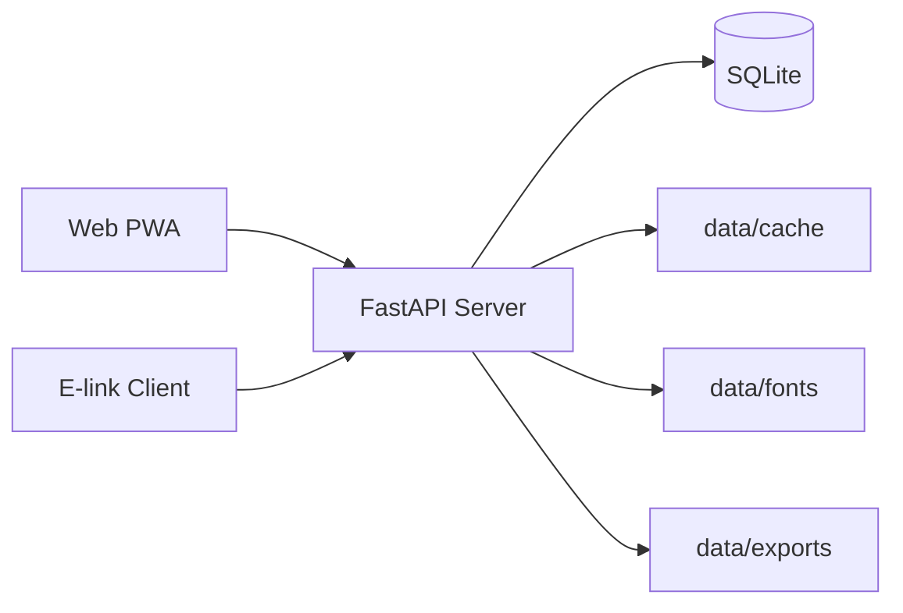

# EasyReader 架构方案

更新时间：2026-06-11

## 审计结论

当前仓库已经不是最初那份“待搭骨架”的方案状态了，但也还没有进入完整产品态。

代码审计后的真实状态是：

- 服务端已经完成书源解析、书架管理、内容获取、服务端缓存、同步进度、书签同步、离线任务、离线目录、字体分发等一组可复用后端能力。
- Web 端已经是可安装 PWA，提供书架、搜索、阅读、设置、离线目录等能力，并具备 IndexedDB + Workbox 的双层离线缓存。
- `e-link-client/` 已经是独立 Android 工程，但它的正确定位不是“PWA 的原生壳”，而是本地阅读优先的墨水屏专用客户端。
- 当前仓库还没有真正落地统一账号、鉴权、有声书、后台任务队列。
- 下一阶段产品路线已经调整：RSS 和漫画暂时从路线图删除，账号 / 鉴权降为低优先级；服务端核心重构、搜索准确度与速度、自动翻页、有声书成为下一步重点。

因此，这份文档不再把“未来愿景”和“当前实现”混写，而是明确区分：

- 当前真实实现
- 多端职责边界
- 下一阶段的重构方向

## 当前部署形态

当前生产形态是单容器部署：

- 前端在 Docker 构建阶段打包为静态文件。
- FastAPI 在运行时同时提供 `/api/*` 和静态文件 SPA 回退。
- 运行期数据全部写入 `data/` volume。
- 容器启动时会把内置字体种子复制到 `data/fonts/`。

运行时拓扑：

## 当前代码模块

### 服务端

- `backend/engine/`: 书源规则引擎与抓取器。
- `backend/services/`: 搜索、内容、书架、导出、字体、同步等业务逻辑。
- `backend/routers/`: 对外 API 路由。
- `backend/database.py`: SQLite schema 与迁移。

### Web PWA

- `frontend/src/pages/`: 书架、阅读、搜索、设置、离线目录等页面。
- `frontend/src/api/client.ts`: 统一 API 客户端。
- `frontend/src/utils/chapter-cache.ts`: IndexedDB 章节缓存。
- `frontend/src/utils/local-cache.ts`: localStorage 快照缓存。
- `frontend/vite.config.ts`: PWA manifest 与 Workbox runtime caching。

### 墨水屏客户端

- `e-link-client/`: 独立 Android 工程。
- 其产品方案见 [e-link-client/docs/eink-client-plan.md](../e-link-client/docs/eink-client-plan.md)。

## 多端角色定义

### 服务端

服务端当前应该被理解为“共享内容与共享状态中心”，并逐步重构成“内容中心 + 状态同步中心 + 任务中心”，而不是前端 UI 的延伸。

它负责：

- 书源规则执行与内容抓取。
- 书架主数据、分类、服务端章节缓存、导出。
- 共享阅读进度、书签同步、离线目录摘要。
- 搜索编排、结果去重、排序、源健康度与搜索缓存。
- 离线缓存任务和后续有声书任务。
- 字体资源分发。
- Web PWA 与墨水屏客户端都可复用的稳定 API。

它当前不负责：

- 客户端排版与阅读器 UI。
- 墨水屏刷新、实体按键、触控热区。
- 自动翻页的页面计算和设备交互。
- 当前阶段不优先承载账号体系与权限控制。
- RSS 和漫画功能扩展。

### Web PWA

Web 端当前定位是“混合在线优先客户端”：

- 适合浏览器 / Android 主屏安装。
- 默认联网请求最新书架、目录、正文和同步状态。
- 同时把目录、章节、离线目录快照写入本地缓存，以支持离线重读。
- 允许预取后续章节，强调通用阅读体验和安装便利。
- 下一步承担自动翻页和有声书播放器体验。

它当前不是：

- 纯离线客户端。
- 墨水屏端的行为模板。
- 原生后台下载能力完整的移动 App。

### 墨水屏客户端

墨水屏端定位是“本地阅读优先客户端”：

- 以稳定、低刷新、低干扰阅读为核心。
- 联网行为必须服务于阅读，而不是反过来影响阅读路径。
- 章节正文下载必须是显式动作。
- 进度同步应该比 PWA 更保守、更低频、更可取消。
- 下一步承担墨水屏自动翻页、实体按键映射和弱网批量补传体验。

## 当前真实能力

### 已落地

- 书源导入、启停、删除。
- 多源搜索。
- 书籍详情、目录、正文获取。
- 本地 TXT / EPUB 导入。
- 书架分类、隐藏、批量操作。
- 服务端章节缓存、批量缓存、批量导出。
- 旧版阅读进度接口 `/api/progress`。
- 新版同步接口 `/api/sync/progress/*` 与 `/api/sync/bookmarks/*`。
- 离线任务接口 `/api/offline/tasks*` 与离线目录 `/api/offline/catalog`。
- 字体列表与字体下载接口。
- PWA 安装、Workbox runtime caching、IndexedDB 章节缓存。

### 未落地或仅停留在旧文档里

- 统一账号 / 鉴权系统。
- 有声书。
- 真正异步的后台离线任务队列。
- 服务端统一响应包装格式。
- 搜索源健康度、结果排序、去重和短 TTL 缓存。

## 当前部署边界

当前部署的核心边界是：

- 服务端持有共享数据和可重复计算的数据。
- 客户端持有设备态、本地缓存和阅读交互态。

更具体地说：

| 领域 | 服务端是权威源 | 客户端是权威源 |
| --- | --- | --- |
| 书架主数据 | 是 | 否 |
| 章节正文原始内容 | 是 | 否 |
| 服务端缓存统计 | 是 | 否 |
| 跨端共享阅读进度 | 是 | 否 |
| 书签同步结果 | 是 | 否 |
| 本地滚动锚点、菜单状态、阅读器布局 | 否 | 是 |
| 浏览器 IndexedDB / Cache Storage | 否 | 是 |
| 墨水屏刷新模式、实体按键映射 | 否 | 是 |

## 当前 API 契约基线

当前多端共享契约详见 [docs/client-server-contract.md](./client-server-contract.md)。

这里只保留架构层面的结论：

- API 当前直接返回 JSON 模型，不包 `code/message/data`。
- `user_id` 和 `device_id` 由客户端自行提供与持久化。
- `/api/sync/progress/upsert` 与 `/api/sync/progress/pull` 已经是当前多端共享进度基线。
- `/api/offline/tasks` 当前是同步执行的“任务风格接口”，不是完整后台队列。
- `/api/version` 现在会返回服务端版本、契约版本和支持的客户端类型。
- 当前 API 还不是长期最佳实践，详细执行方案见 [docs/next-stage-execution-plan.md](./next-stage-execution-plan.md)。

## 与旧架构文档的主要偏差

这次审计确认，旧版总体架构文档有四类偏差：

1. 把未来产品范围写成了当前已落地能力，例如有声书、统一账号和完整后台任务。
2. 把 PWA 写成了更接近“原生 App”的离线模型，但真实代码是混合在线优先。
3. 把离线任务写成了后台队列，但当前实现实际上在请求内完成服务端缓存。
4. 把多端身份写成统一账号，但当前真实实现仍是客户端自管 `user_id/device_id`。

## 下一阶段架构重点

### P0：先把当前基线写实并锁定

- 以 [docs/client-server-contract.md](./client-server-contract.md) 为准，统一服务端、PWA、墨水屏端的接口描述。
- 保持服务端 API 对 PWA 和墨水屏端都可复用，但不强迫两个客户端采用同一种联网策略。

### P0：PWA 与墨水屏端分轨

- PWA 继续保留在线优先 + 本地缓存增强。
- 墨水屏端只保留阅读必要能力，并使用收敛后的同步/下载策略。

### P0：服务端核心重构

- 搜索准确度与速度优先：结果评分、去重、源健康度、缓存和快速模式。
- 资源身份收口：引入 `book_key`，减少客户端长期依赖 `book_url + source_url`。
- 离线任务真正任务化，为后续有声书任务复用同一任务层。
- 同步接口幂等化：source-aware key、batch upsert、revision 生成改造。

### P1：客户端阅读体验

- PWA 自动翻页。
- 墨水屏端自动翻页、实体按键映射和弱网批量补传。

### P1：有声书能力

- 服务端音频任务与音频缓存。
- PWA 播放器。
- 墨水屏端最小播放控制。

### P2：补真正的多用户能力

- 在后续账号系统落地前，文档和代码都不再把 `demo-user + device_id` 方案描述成“统一账号”。

### 暂不做

- RSS。
- 漫画路线扩展。
- 重型账号 / 权限系统。

## 相关文档

- [docs/README.md](./README.md)
- [docs/client-server-contract.md](./client-server-contract.md)
- [docs/next-stage-execution-plan.md](./next-stage-execution-plan.md)
- [e-link-client/docs/eink-client-plan.md](../e-link-client/docs/eink-client-plan.md)